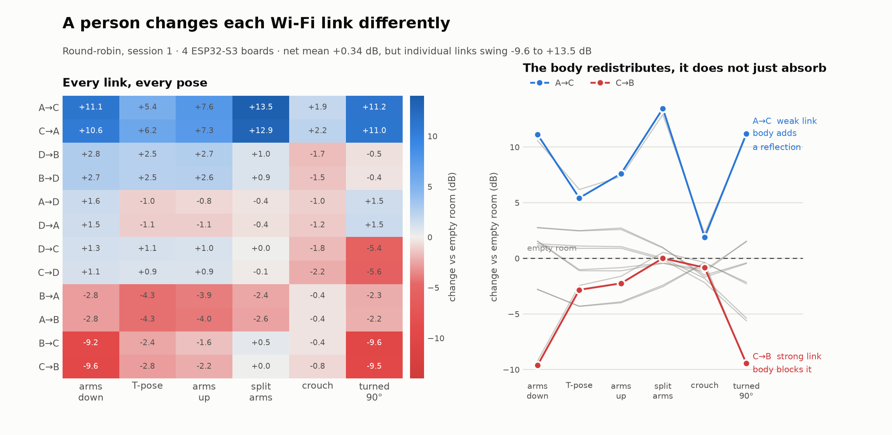

# CSI round-robin — working notes

State as of the end of the first session, so this can be picked up on another machine.

## Hardware

Four ESP32-S3 (N16R8) boards, all running identical `csi_roundrobin` firmware,
connected by USB to one PC. Boards are identified by MAC, not by `/dev/ttyACM*`
path — the path changes on every replug and the tooling auto-discovers.

| MAC | USB serial |
|---|---|
| `14:c1:9f:c1:2d:3c` | 5C37261255 |
| `dc:da:0c:77:6b:5c` | 5C37262351 |
| `30:30:f9:1d:ab:d4` | 5C39018763 |
| `14:c1:9f:c1:2d:a8` | 5C39020696 |

A fifth board (`ec:da:3b:4c:b8:d0` / 5C39018759) was **returned as faulty**. Its
transmit path was perfect (~50 pkt/s to every peer) but its receive path dropped
most packets, including signals arriving at -4 dBm. Ruled out by measurement:
distance/geometry, antenna orientation, noise floor (it had the *lowest* of the
five), per-board TX/RX bias (only ±1 dB across the set), and the USB cable (fault
did not follow a cable swap). The clincher was same-pair/opposite-direction at
matched path loss: 49.5 pkt/s one way vs 4.5 the other, ~1 dB apart.

The remaining four are well matched, all 12 directed links run 46.8-50.0 pkt/s,
and five of six pairs agree within ~1 dB in both directions.

## Things learned the hard way

- **Orientation dominates.** One board lying flat instead of upright dropped it
  from ~49 to ~5.5 pkt/s as a transmitter — polarisation mismatch, worth far more
  than any bench-scale distance change. Keep every board upright, same height,
  antenna end clear, cables routed away from the antenna.
- **UART sets the ceiling, but 100 Hz fits — the old 50 Hz limit was stale.**
  921600 8N1 carries 92.2 KB/s; a *raw I/Q* line was ~1215 B, which is what made
  100 Hz saturate. Dropping phase halved it: measured over real captures a line is
  626 B (603-642). A receiver sees the full ping rate during a turn and is RX for
  3 of every 4 turns, so 100 Hz costs 62.6 KB/s burst (68%) and 46.9 KB/s average
  (51%). 150 Hz would need 93.9 KB/s burst — over the link — so 100 is the ceiling
  for this encoding. Raised 2026-08-12; no truncated lines observed (every capture
  came back at the full 192 subcarriers).
- **A restarted periodic timer loses its first interval.** `become_tx()` called
  `esp_timer_start_periodic`, whose first callback fires one whole period later, so
  the opening 20 ms of every 50 ms dwell was silent — each turn yielded ~1.3 of the
  2.5 packets it should. Firing one ping directly after the start fixed it. Combined
  with the 100 Hz change, per-link rate went **5.2 -> 14.4 Hz** and, because short
  dwells are no longer penalised, a 50 ms dwell now beats 100 ms on *both* rate and
  revisit interval (14.4 Hz / 170 ms vs 14.6 Hz / 314 ms).
- **`ets_printf` is not atomic across tasks.** CSI prints from the WiFi task and
  role markers from the UART command task; concurrent calls interleave mid-line
  and destroyed ~23% of role markers until a mutex was added.
- **Diagnostics need to fail loudly in both directions.** A marker-loss check
  that only detected one failure mode reported "0% loss" while a quarter of the
  markers were missing.

## Tools

- `roundrobin_viewer.py` — combined scheduler + live viewer. Per-(receiver,
  transmitter) binned waterfalls; each link binned separately so a bin spanning a
  handoff cannot blend two links. `--bin-hz` sets integration rate.
- `pairwise_matrix.py` — full directed link matrix (rate + RSSI), `--save` /
  `--compare` for before/after hardware changes. Keyed by MAC.
- `pose_suitability.py` — capture in `fixedtx` or `roundrobin` mode, then
  `analyze` for sampling rate, motion-vs-static variation, channel coherence,
  effective dimensionality and link diversity.

## Ground-truth camera

Intel RealSense **D435i**, serial `039223051974`, on USB 3.0 at 5000M (full link
speed -- at 480M the firmware silently drops the higher stream modes).

| node | stream | verified |
|---|---|---|
| `/dev/video2` | Z16 depth | 640x480 @ 90 fps, centre patch 99% valid |
| `/dev/video4` | Y8I/Y12I infrared (both imagers) | enumerated |
| `/dev/video6` | YUYV colour | 640x480 @ 60 fps |

`video3/5/7` are the matching metadata nodes. Verified by raw V4L2 capture with
no SDK (`rs_probe.py`), so the camera, cable, link and permissions are known-good
independently of librealsense -- which is **not installed** on the host or in the
container yet. A `cp312` manylinux wheel of `pyrealsense2` 2.58.3 exists, so
`pip install pyrealsense2` is all that is needed.

Container access needed `c 81:* rmw` and `c 234:* rmw` in `device_cgroup_rules`
(see `docker-compose.yml`); the `/dev` bind mount alone makes the nodes visible
but not openable, exactly as with the serial ports.

## Room geometry (setup 3, 2026-08-12, 4 boards)

A 3 m square, two rows: **D C** on the far row, **A B** on the near row.

| board | MAC | x (m) | y (m) |
|---|---|---|---|
| A | `14:c1:9f:c1:2d:3c` | 0.00 | 0.00 |
| B | `dc:da:0c:77:6b:5c` | 3.00 | 0.00 |
| C | `30:30:f9:1d:ab:d4` | 3.00 | 3.00 |
| D | `14:c1:9f:c1:2d:a8` | 0.00 | 3.00 |

Neighbours 3.00 m, diagonals 4.243 m (measured as 4.25). Four link orientations --
0 deg (A-B, C-D), 45 deg (A-C), 90 deg (A-D, B-C), 135 deg (B-D) -- so the array is
angularly well spread, unlike setup 2 where two pairs were near-parallel.

**Geometry does not predict link quality here.** Measured single-link activity
accuracy over the 12-08 corpus spans 18.7% to 38.7% (chance 20%), and it does not
follow the layout at all:

| pair | length | angle | distance from centre | accuracy |
|---|---|---|---|---|
| A-D | 3.00 m | 90 deg | 1.50 m | **38.7%** |
| C-D | 3.00 m | 0 deg | 1.50 m | 28.0% |
| B-D | 4.24 m | 135 deg | **0 m** | 28.0% |
| A-C | 4.24 m | 45 deg | **0 m** | 28.0% |
| A-B | 3.00 m | 0 deg | 1.50 m | 21.3% |
| B-C | 3.00 m | 90 deg | 1.50 m | **18.7%** |

The four edges are geometrically identical -- same length, same 1.50 m from the
centre -- yet span 18.7% to 38.7%. The two diagonals pass *through* the centre where
the subject stands and are only mid-table. Correlation between accuracy and
distance-from-centre is **-0.10**, i.e. none. So link quality is set by multipath,
board orientation and surroundings, not by the array layout -- the same conclusion
the RSSI-vs-distance result below reached by another route. Do not explain link
strength geometrically without measuring it.

Setup 2 (2026-08-10, a 3.9 x 3.25 m rectangle) applies only to the archived corpus
in `data/_archive_2026-08-10_poses/`.

## RSSI is useless for distance here -- localization by multilateration is dead

With true distances known, measured RSSI correlates **positively** with distance
(+0.59), giving a fitted path-loss exponent of **-2.92** (free space is +2.0,
indoor 2-4; negative is unphysical). Concretely CD spans 4.09 m at -39.3 dBm
while BC spans 2.95 m at -55.6 dBm -- the shorter link is 16 dB weaker.
Reciprocity is fine (asymmetry 0.0-2.8 dB), so this is the propagation
environment, not the hardware. Multipath and orientation dominate distance
completely at room scale. This confirms, with ground truth, the earlier failure
where MDS produced a non-Euclidean distance matrix.

CSI fingerprinting against surveyed positions remains plausible; RSSI
trilateration does not.

## Validation status

**Hardware: validated.** Four boards matched to +/-1 dB TX/RX bias, all 12
directed links 46.8-50 pkt/s, reciprocity 0.0-2.8 dB. The one defective board
was identified and characterised by these measurements.

**Round-robin method: validated.** 0% role-marker loss over 289 handoffs at 50 ms
rounds, per-link data cleanly attributed by transmitter, 12 links at 9.5 Hz.
Presence detectable at z~27; held poses separable at 22.3 sigma median.

Validated as *sufficient*. Whether round-robin is *optimal* versus fixed-TX for
pose work is still open -- see the link ablation and the missing fixed-TX pose
capture below.

## Pose-estimation assessment

Measured with `capture_wizard.py` (three conditions: empty room / person still /
person moving) and `analyze_wizard.py`. The empty-room reference is what an
earlier attempt lacked, and it passed its drift check this time (ratio 0.0-0.4,
lag-1 autocorr ~0, i.e. a genuine white-noise floor).

**Presence is trivially detectable.** A *motionless* person shifts the channel
mean by z = 16-66 sigma (mean 27.5 across 12 links). An earlier read of
"undetectable" was wrong: it compared variances, which are blind to a constant
offset. This matters because it means body configuration is encoded in the
static channel signature, not only in motion -- the precondition for reading a
held pose.

**Motion is clearly detectable.** Round-robin 3.45x vs empty, fixed-TX 2.14x.

**Round-robin beats fixed-TX for this task**, reversing an earlier verdict that
was based on sampling rate alone:

| mode | links | rate | motion vs empty | effective rank |
|---|---|---|---|---|
| fixed-TX | 3 | 46 Hz | 2.14x | 6 |
| round-robin | 12 | 5 Hz | 3.45x | 9 |

**The real limit is dimensionality, not rate.** After removing the empty-room
mean, the moving data has an effective rank of only 6-9 (95% of variance) out of
576-2304 raw features. A human skeleton is 30-60 DOF, so full skeletal pose is
underdetermined by roughly 5x. Feasible: presence, occupancy, activity
recognition, coarse pose classification. Not feasible with this setup: dense
skeletal pose.

Caveat on that rank figure: it was measured on a single motion sequence (arms,
turn, squat). A low rank may partly reflect limited motion diversity rather than
a sensor limit -- the same confound that made the earlier line-geometry numbers
useless.

### Held-pose discrimination -- the decisive test

Six held poses plus an empty room, round-robin, `analyze_poses.py`:

| | |
|---|---|
| chance | 14.3% |
| leave-one-out | 97.9% (optimistic: adjacent windows correlate) |
| **temporal split** | **88.7%** (train first half of each hold, test second half) |
| median pairwise separability | 22.3 sigma, no pair below 3 |

With four boards, **amplitude only**, 12 s per pose and a nearest-centroid
classifier on 20 PCs. The only real confusion is T-pose vs arms-up (both put the
arms away from the torso), which is semantically coherent rather than arbitrary
-- mild evidence the classifier keys on body configuration, not session noise.

This overturns an earlier pessimistic reading here that compared "effective rank
6-9" against 30-60 skeleton DOF. That was wrong twice over: pose lives on a
low-dimensional manifold so raw DOF is the wrong denominator, and the rank
itself was unmeasurable from that data (round-robin's "120 components above
noise" was exactly its 120 time samples -- observation-limited, not
channel-limited).

### Link-count ablation (same data, same classifier)

| links | accuracy |
|---|---|
| all 12 | 88.7% |
| 6 (two TX) | 85.6-88.7% |
| 3 (one TX) | 82.5-84.5% |

4x the links buys ~5 points -- strongly sublinear, matching the measured link
redundancy. Note these 3-link figures come from round-robin data at 9.5 Hz; a
real fixed-TX capture supplies the same 3 links at ~46 Hz, ~2.2x less
per-window noise, so fixed-TX may match or beat round-robin on held poses.
**Fixed-TX poses were never captured** -- that comparison is open.

Regenerate with `plot_pose_db.py --prefix ps`. The body **redistributes** signal
rather than absorbing it: net mean +0.34 dB while individual links swing -9.6 to
+13.5 dB. A->B (4.70 m, strong, direct path through the middle) loses on every
pose; A<->C (2.30 m but weak, a destructive-interference link) gains 2-13 dB
because the body acts as a scatterer filling a null. The ~11 dB spread across
poses on that one link is where most of the classification power sits -- the
weakest link is the most informative one.

### Cross-session generalization -- a data-scale limit, not a hardware one

Session 2: same six poses, subject deliberately standing in a slightly shifted
spot. Model (scaling, PCA basis, centroids) fitted on session 1 only, frozen,
applied to session 2 (`analyze_crosssession.py`).

| | |
|---|---|
| within session 2 (temporal split) | 100.0% |
| **cross-session** | **47.5% (train stats) / 51.1% (per-session centring)** |
| chance | 14.3% |

So a model trained at one standing spot does not transfer to another. This is a
statement about training data, not about the instrument: 6 poses x 12 s from a
single position is far too little to expect position invariance. Only `empty`
(49/49) and `up` (15/15) transferred.

But it is *not* a total failure, and the reason matters. Cosine similarity
between session-1 and session-2 pose signatures (each session mean-removed):

- same pose across sessions: **+0.57** mean
- different poses: **-0.08** mean

Transferable pose information clearly exists. What fails is the *margin*: four
of seven diagonals are strong (0.63-0.75) but several off-diagonals are just as
high (turned/turned 0.73 vs turned/crouch 0.76; split/split 0.63 vs split/tpose
0.74), so nearest-centroid picks wrong by a hair. This also rules out two
alternative explanations -- a systematic label/timing shift would make one
off-diagonal dominate consistently, and position scrambling the signatures
outright would leave the matrix unstructured. Neither is what we see.

Confound: position and time both changed between sessions, so their
contributions cannot be separated here. Position is very likely dominant.

### Fixed-TX poses, and a controlled rate test

Fixed-TX pose capture (board A transmitting, 3 links at 41.5 Hz), same six
poses: **97.9%** temporal split, median separability 24.2, two errors in 97 test
windows.

Decimating that same capture -- same session, same position, same links, only
the rate reduced -- isolates the effect of sample rate:

| per-link rate | accuracy |
|---|---|
| 41.5 Hz | 97.9% |
| 20.8 Hz | 96.9% |
| 10.4 Hz | 96.9% |
| 6.9 Hz | 93.8% |

**Sample rate barely matters for held poses.** A 4x decimation costs one point.
This makes sense in retrospect: a held pose has no temporal content to resolve,
so what is needed is a clean spatial signature rather than a fast one. It also
refutes the earlier prediction here that fixed-TX would beat round-robin *via*
its higher rate.

**The mode comparison is therefore still not resolved, and probably cannot be
from this data.** At matched rate and link count fixed-TX scores 96.9% against
the round-robin 3-link subset's 82.5-84.5%, but those come from different
sessions and standing positions, and round-robin's own two sessions spanned
88.7% to 100%. Session-to-session variation is as large as the gap that would
be attributed to mode. Settling it needs both modes captured back-to-back from
one position.

Practical consequence: round-robin's ~9.5 Hz per-link rate, flagged early in
this project as disqualifying for pose work, is **not** a handicap for static
pose. Rate would only matter for tracking motion, which is a different task.

### Next steps

1. **Train across multiple standing positions** (3-5 spots). Still the single
   most valuable next dataset -- see the cross-session result above.
2. **A better classifier than nearest-centroid**, once multi-position data
   exists.
3. **Mode comparison back-to-back from one position**, if it matters; both
   modes already work well enough that this is low priority.
4. **Restore phase** (stripped for UART bandwidth).
