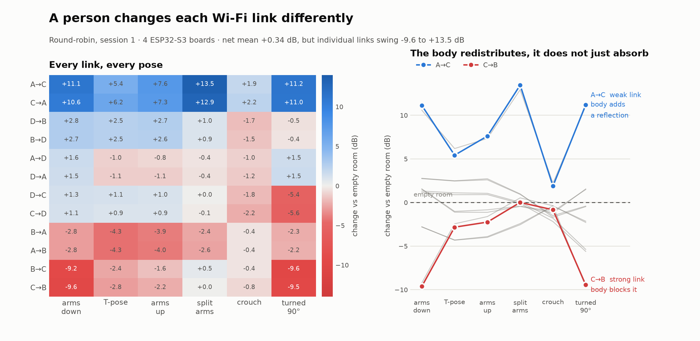

# CSI round-robin — working notes

State as of the end of the first session, so this can be picked up on another machine.

## Hardware

Four ESP32-S3 (N16R8) boards, all running identical `csi_roundrobin` firmware,
connected by USB to one PC. Boards are identified by MAC, not by `/dev/ttyACM*`
path — the path changes on every replug and the tooling auto-discovers.

| MAC | USB serial |
|---|---|
| `14:c1:9f:c1:2d:3c` | 5C37261255 |
| `dc:da:0c:77:6b:5c` | 5C37262351 |
| `30:30:f9:1d:ab:d4` | 5C39018763 |
| `14:c1:9f:c1:2d:a8` | 5C39020696 |

A fifth board (`ec:da:3b:4c:b8:d0` / 5C39018759) was **returned as faulty**. Its
transmit path was perfect (~50 pkt/s to every peer) but its receive path dropped
most packets, including signals arriving at -4 dBm. Ruled out by measurement:
distance/geometry, antenna orientation, noise floor (it had the *lowest* of the
five), per-board TX/RX bias (only ±1 dB across the set), and the USB cable (fault
did not follow a cable swap). The clincher was same-pair/opposite-direction at
matched path loss: 49.5 pkt/s one way vs 4.5 the other, ~1 dB apart.

The remaining four are well matched, all 12 directed links run 46.8-50.0 pkt/s,
and five of six pairs agree within ~1 dB in both directions.

## Things learned the hard way

- **Orientation dominates.** One board lying flat instead of upright dropped it
  from ~49 to ~5.5 pkt/s as a transmitter — polarisation mismatch, worth far more
  than any bench-scale distance change. Keep every board upright, same height,
  antenna end clear, cables routed away from the antenna.
- **UART sets the ceiling, but 100 Hz fits — the old 50 Hz limit was stale.**
  921600 8N1 carries 92.2 KB/s; a *raw I/Q* line was ~1215 B, which is what made
  100 Hz saturate. Dropping phase halved it: measured over real captures a line is
  626 B (603-642). A receiver sees the full ping rate during a turn and is RX for
  3 of every 4 turns, so 100 Hz costs 62.6 KB/s burst (68%) and 46.9 KB/s average
  (51%). 150 Hz would need 93.9 KB/s burst — over the link — so 100 is the ceiling
  for this encoding. Raised 2026-08-12; no truncated lines observed (every capture
  came back at the full 192 subcarriers).
- **A restarted periodic timer loses its first interval.** `become_tx()` called
  `esp_timer_start_periodic`, whose first callback fires one whole period later, so
  the opening 20 ms of every 50 ms dwell was silent — each turn yielded ~1.3 of the
  2.5 packets it should. Firing one ping directly after the start fixed it. Combined
  with the 100 Hz change, per-link rate went **5.2 -> 14.4 Hz** and, because short
  dwells are no longer penalised, a 50 ms dwell now beats 100 ms on *both* rate and
  revisit interval (14.4 Hz / 170 ms vs 14.6 Hz / 314 ms).
- **`ets_printf` is not atomic across tasks.** CSI prints from the WiFi task and
  role markers from the UART command task; concurrent calls interleave mid-line
  and destroyed ~23% of role markers until a mutex was added.
- **Diagnostics need to fail loudly in both directions.** A marker-loss check
  that only detected one failure mode reported "0% loss" while a quarter of the
  markers were missing.

## Tools

- `roundrobin_viewer.py` — combined scheduler + live viewer. Per-(receiver,
  transmitter) binned waterfalls; each link binned separately so a bin spanning a
  handoff cannot blend two links. `--bin-hz` sets integration rate.
- `pairwise_matrix.py` — full directed link matrix (rate + RSSI), `--save` /
  `--compare` for before/after hardware changes. Keyed by MAC.
- `pose_suitability.py` — capture in `fixedtx` or `roundrobin` mode, then
  `analyze` for sampling rate, motion-vs-static variation, channel coherence,
  effective dimensionality and link diversity.

## Ground-truth camera

Intel RealSense **D435i**, serial `039223051974`, on USB 3.0 at 5000M (full link
speed -- at 480M the firmware silently drops the higher stream modes).

| node | stream | verified |
|---|---|---|
| `/dev/video2` | Z16 depth | 640x480 @ 90 fps, centre patch 99% valid |
| `/dev/video4` | Y8I/Y12I infrared (both imagers) | enumerated |
| `/dev/video6` | YUYV colour | 640x480 @ 60 fps |

`video3/5/7` are the matching metadata nodes. Verified by raw V4L2 capture with
no SDK (`rs_probe.py`), so the camera, cable, link and permissions are known-good
independently of librealsense -- which is **not installed** on the host or in the
container yet. A `cp312` manylinux wheel of `pyrealsense2` 2.58.3 exists, so
`pip install pyrealsense2` is all that is needed.

Container access needed `c 81:* rmw` and `c 234:* rmw` in `device_cgroup_rules`
(see `docker-compose.yml`); the `/dev` bind mount alone makes the nodes visible
but not openable, exactly as with the serial ports.

## Room geometry (setup 3, 2026-08-12, 4 boards)

A 3 m square, two rows: **D C** on the far row, **A B** on the near row.

| board | MAC | x (m) | y (m) |
|---|---|---|---|
| A | `14:c1:9f:c1:2d:3c` | 0.00 | 0.00 |
| B | `dc:da:0c:77:6b:5c` | 3.00 | 0.00 |
| C | `30:30:f9:1d:ab:d4` | 3.00 | 3.00 |
| D | `14:c1:9f:c1:2d:a8` | 0.00 | 3.00 |

Neighbours 3.00 m, diagonals 4.243 m (measured as 4.25). Four link orientations --
0 deg (A-B, C-D), 45 deg (A-C), 90 deg (A-D, B-C), 135 deg (B-D) -- so the array is
angularly well spread, unlike setup 2 where two pairs were near-parallel.

**Geometry does not predict link quality here.** Measured single-link activity
accuracy over the 12-08 corpus spans 18.7% to 38.7% (chance 20%), and it does not
follow the layout at all:

| pair | length | angle | distance from centre | accuracy |
|---|---|---|---|---|
| A-D | 3.00 m | 90 deg | 1.50 m | **38.7%** |
| C-D | 3.00 m | 0 deg | 1.50 m | 28.0% |
| B-D | 4.24 m | 135 deg | **0 m** | 28.0% |
| A-C | 4.24 m | 45 deg | **0 m** | 28.0% |
| A-B | 3.00 m | 0 deg | 1.50 m | 21.3% |
| B-C | 3.00 m | 90 deg | 1.50 m | **18.7%** |

The four edges are geometrically identical -- same length, same 1.50 m from the
centre -- yet span 18.7% to 38.7%. The two diagonals pass *through* the centre where
the subject stands and are only mid-table. Correlation between accuracy and
distance-from-centre is **-0.10**, i.e. none. So link quality is set by multipath,
board orientation and surroundings, not by the array layout -- the same conclusion
the RSSI-vs-distance result below reached by another route. Do not explain link
strength geometrically without measuring it.

Setup 2 (2026-08-10, a 3.9 x 3.25 m rectangle) applies only to the archived corpus
in `data/_archive_2026-08-10_poses/`.

## RSSI is useless for distance here -- localization by multilateration is dead

With true distances known, measured RSSI correlates **positively** with distance
(+0.59), giving a fitted path-loss exponent of **-2.92** (free space is +2.0,
indoor 2-4; negative is unphysical). Concretely CD spans 4.09 m at -39.3 dBm
while BC spans 2.95 m at -55.6 dBm -- the shorter link is 16 dB weaker.
Reciprocity is fine (asymmetry 0.0-2.8 dB), so this is the propagation
environment, not the hardware. Multipath and orientation dominate distance
completely at room scale. This confirms, with ground truth, the earlier failure
where MDS produced a non-Euclidean distance matrix.

CSI fingerprinting against surveyed positions remains plausible; RSSI
trilateration does not.

## Validation status

**Hardware: validated.** Four boards matched to +/-1 dB TX/RX bias, all 12
directed links 46.8-50 pkt/s, reciprocity 0.0-2.8 dB. The one defective board
was identified and characterised by these measurements.

**Round-robin method: validated.** 0% role-marker loss over 289 handoffs at 50 ms
rounds, per-link data cleanly attributed by transmitter, 12 links at 9.5 Hz.
Presence detectable at z~27; held poses separable at 22.3 sigma median.

Validated as *sufficient*. Whether round-robin is *optimal* versus fixed-TX for
pose work is still open -- see the link ablation and the missing fixed-TX pose
capture below.

## Pose-estimation assessment

Measured with `capture_wizard.py` (three conditions: empty room / person still /
person moving) and `analyze_wizard.py`. The empty-room reference is what an
earlier attempt lacked, and it passed its drift check this time (ratio 0.0-0.4,
lag-1 autocorr ~0, i.e. a genuine white-noise floor).

**Presence is trivially detectable.** A *motionless* person shifts the channel
mean by z = 16-66 sigma (mean 27.5 across 12 links). An earlier read of
"undetectable" was wrong: it compared variances, which are blind to a constant
offset. This matters because it means body configuration is encoded in the
static channel signature, not only in motion -- the precondition for reading a
held pose.

**Motion is clearly detectable.** Round-robin 3.45x vs empty, fixed-TX 2.14x.

**Round-robin beats fixed-TX for this task**, reversing an earlier verdict that
was based on sampling rate alone:

| mode | links | rate | motion vs empty | effective rank |
|---|---|---|---|---|
| fixed-TX | 3 | 46 Hz | 2.14x | 6 |
| round-robin | 12 | 5 Hz | 3.45x | 9 |

**The real limit is dimensionality, not rate.** After removing the empty-room
mean, the moving data has an effective rank of only 6-9 (95% of variance) out of
576-2304 raw features. A human skeleton is 30-60 DOF, so full skeletal pose is
underdetermined by roughly 5x. Feasible: presence, occupancy, activity
recognition, coarse pose classification. Not feasible with this setup: dense
skeletal pose.

Caveat on that rank figure: it was measured on a single motion sequence (arms,
turn, squat). A low rank may partly reflect limited motion diversity rather than
a sensor limit -- the same confound that made the earlier line-geometry numbers
useless.

### Held-pose discrimination -- the decisive test

Six held poses plus an empty room, round-robin, `analyze_poses.py`:

| | |
|---|---|
| chance | 14.3% |
| leave-one-out | 97.9% (optimistic: adjacent windows correlate) |
| **temporal split** | **88.7%** (train first half of each hold, test second half) |
| median pairwise separability | 22.3 sigma, no pair below 3 |

With four boards, **amplitude only**, 12 s per pose and a nearest-centroid
classifier on 20 PCs. The only real confusion is T-pose vs arms-up (both put the
arms away from the torso), which is semantically coherent rather than arbitrary
-- mild evidence the classifier keys on body configuration, not session noise.

This overturns an earlier pessimistic reading here that compared "effective rank
6-9" against 30-60 skeleton DOF. That was wrong twice over: pose lives on a
low-dimensional manifold so raw DOF is the wrong denominator, and the rank
itself was unmeasurable from that data (round-robin's "120 components above
noise" was exactly its 120 time samples -- observation-limited, not
channel-limited).

### Link-count ablation (same data, same classifier)

| links | accuracy |
|---|---|
| all 12 | 88.7% |
| 6 (two TX) | 85.6-88.7% |
| 3 (one TX) | 82.5-84.5% |

4x the links buys ~5 points -- strongly sublinear, matching the measured link
redundancy. Note these 3-link figures come from round-robin data at 9.5 Hz; a
real fixed-TX capture supplies the same 3 links at ~46 Hz, ~2.2x less
per-window noise, so fixed-TX may match or beat round-robin on held poses.
**Fixed-TX poses were never captured** -- that comparison is open.

Regenerate with `plot_pose_db.py --prefix ps`. The body **redistributes** signal
rather than absorbing it: net mean +0.34 dB while individual links swing -9.6 to
+13.5 dB. A->B (4.70 m, strong, direct path through the middle) loses on every
pose; A<->C (2.30 m but weak, a destructive-interference link) gains 2-13 dB
because the body acts as a scatterer filling a null. The ~11 dB spread across
poses on that one link is where most of the classification power sits -- the
weakest link is the most informative one.

### Cross-session generalization -- a data-scale limit, not a hardware one

Session 2: same six poses, subject deliberately standing in a slightly shifted
spot. Model (scaling, PCA basis, centroids) fitted on session 1 only, frozen,
applied to session 2 (`analyze_crosssession.py`).

| | |
|---|---|
| within session 2 (temporal split) | 100.0% |
| **cross-session** | **47.5% (train stats) / 51.1% (per-session centring)** |
| chance | 14.3% |

So a model trained at one standing spot does not transfer to another. This is a
statement about training data, not about the instrument: 6 poses x 12 s from a
single position is far too little to expect position invariance. Only `empty`
(49/49) and `up` (15/15) transferred.

But it is *not* a total failure, and the reason matters. Cosine similarity
between session-1 and session-2 pose signatures (each session mean-removed):

- same pose across sessions: **+0.57** mean
- different poses: **-0.08** mean

Transferable pose information clearly exists. What fails is the *margin*: four
of seven diagonals are strong (0.63-0.75) but several off-diagonals are just as
high (turned/turned 0.73 vs turned/crouch 0.76; split/split 0.63 vs split/tpose
0.74), so nearest-centroid picks wrong by a hair. This also rules out two
alternative explanations -- a systematic label/timing shift would make one
off-diagonal dominate consistently, and position scrambling the signatures
outright would leave the matrix unstructured. Neither is what we see.

Confound: position and time both changed between sessions, so their
contributions cannot be separated here. Position is very likely dominant.

### Fixed-TX poses, and a controlled rate test

Fixed-TX pose capture (board A transmitting, 3 links at 41.5 Hz), same six
poses: **97.9%** temporal split, median separability 24.2, two errors in 97 test
windows.

Decimating that same capture -- same session, same position, same links, only
the rate reduced -- isolates the effect of sample rate:

| per-link rate | accuracy |
|---|---|
| 41.5 Hz | 97.9% |
| 20.8 Hz | 96.9% |
| 10.4 Hz | 96.9% |
| 6.9 Hz | 93.8% |

**Sample rate barely matters for held poses.** A 4x decimation costs one point.
This makes sense in retrospect: a held pose has no temporal content to resolve,
so what is needed is a clean spatial signature rather than a fast one. It also
refutes the earlier prediction here that fixed-TX would beat round-robin *via*
its higher rate.

**The mode comparison is therefore still not resolved, and probably cannot be
from this data.** At matched rate and link count fixed-TX scores 96.9% against
the round-robin 3-link subset's 82.5-84.5%, but those come from different
sessions and standing positions, and round-robin's own two sessions spanned
88.7% to 100%. Session-to-session variation is as large as the gap that would
be attributed to mode. Settling it needs both modes captured back-to-back from
one position.

Practical consequence: round-robin's ~9.5 Hz per-link rate, flagged early in
this project as disqualifying for pose work, is **not** a handicap for static
pose. Rate would only matter for tracking motion, which is a different task.

### Next steps

1. **Train across multiple standing positions** (3-5 spots). Still the single
   most valuable next dataset -- see the cross-session result above.
2. **A better classifier than nearest-centroid**, once multi-position data
   exists.
3. **Mode comparison back-to-back from one position**, if it matters; both
   modes already work well enough that this is low priority.
4. ~~**Restore phase** (stripped for UART bandwidth).~~ Done -- see below.

## 2026-08-13 -- I/Q firmware, and the UART ceiling was never where we thought

Everything below in one table. All three columns are **measured from real captures**
of the same kind -- the first from `data/gergo_train/salute0.npz` (the recorded
campaign), the other two from 20 s test captures -- and all use the same 12 links and
the same statistics, so the columns are comparable rather than quoted from different
kinds of run.

| | campaign (v1) | I/Q, old dwell | I/Q 30 SC, tuned | **shipped: 166 SC** |
|---|---|---|---|---|
| payload | uint8 amplitude | int8 I/Q | int8 I/Q | int8 I/Q |
| phase | no | yes | yes | **yes** |
| subcarriers | 192 (166 live) | 30 | 30 | **166, all live** |
| frame | 212 B | 82 B | 82 B | **354 B** |
| ping rate | 125 Hz | 400 Hz | 675 Hz | **243 Hz** |
| dwell | 50 ms | 50 ms | 12.5 ms | **25 ms** |
| cycle (4 boards) | 200 ms | 200 ms | 50 ms | **100 ms** |
| per-link rate | 25.8 Hz | 92.3 Hz | *118.4 Hz* | **43.5 Hz** (1.7x campaign) |
| median gap | 8.19 ms | 1.86 ms | *1.39 ms* | **4.19 ms** |
| p99 gap (blind window) | 192.5 ms | 165.8 ms | *71.4 ms* | **99.9 ms** (1.9x better) |
| duty cycle | 14.0% | 12.0% | 10.7% | **14.6%** |
| UART burst load | 26.5 KB/s (29%) | 32.8 KB/s (36%) | 55.4 KB/s (60%) | **86.0 KB/s (93%)** |
| checksum failures | 0 | 0 | 0 | **0** |

All four columns are **measured from real captures** with identical statistics over the
same 12 links -- the first from `data/gergo_train/salute0.npz`, the rest from 20 s test
captures -- so they compare like with like.

**The shipped column is not the best on rate or gap, and that is the deliberate
choice.** 30 SC wins on both (118 vs 43 Hz, 71 vs 100 ms). It was chosen anyway
because the R^2 = 0.973 result that justifies 30 subcarriers was measured on recorded
*amplitude*, and nothing has yet checked whether it holds for phase. Subsetting stays
possible in analysis; discarding at the boards does not. Switch with `SUB 30` plus
675 Hz and a 12.5 ms dwell if the rate turns out to matter more.

**The three knobs are not independent.** Frame size sets the ping ceiling, and ping
rate and frame size together set the best dwell: 166 SC is 3.84 ms of UART per frame,
so a 12.5 ms dwell fits too few frames and measures *worse* than 25 ms (p99 106.6 vs
101.2 ms). Change one, re-measure all three.

Read the two gap rows together; they answer different questions. **Median** is spacing
*inside* a burst and follows ping rate. **p99** is the blind window between bursts and
follows dwell. Raising rate alone (column 2) barely moved p99: 192.5 -> 165.8 ms for
3.2x the pings. Dwell is what moves it. Tune dwell first.

Duty cycle sits at 11-15% throughout, which is arithmetic rather than a shortfall:
duty is roughly dwell/cycle, and shortening dwell shortens both. What improves is how
*often* a link is revisited.

At 93% UART the shipped config has little headroom left, which is why it is the knee
minus 10% rather than the knee. It sustained 20 s of real capture and a 15 s sweep
with zero checksum failures and all boards responsive, but it is the closest to the
edge anything here has run -- watch `check_session` on the first real session.

Phase is back. `CONFIG_IQ_MODE` emits raw int8 I/Q as frame version 2 instead of
computed uint8 amplitude, and `CONFIG_SUB_COUNT` is now 30. Those two go together:
30 complex subcarriers is an 82 B frame against 212 B for 192 amplitudes, so phase
costs *nothing* in bandwidth and buys rate at the same time. 192 complex would have
been 404 B and not worth it.

The version byte carries the format, so `capture.py` reads both encodings and the
450 v1 takes stay readable through the same code path. `|iq|` reproduces the v1
amplitude exactly, so amplitude-only consumers needed no changes at all.

**I/Q is sent uncompensated with the AGC factor in the header.** Applying gain on
the board means rounding a scaled value back into int8, which destroys exactly the
low-order bits phase is estimated from. The host has floats; there it is free.

### The 68% UART limit was an artefact of ets_printf, not of the UART

Swept 400-1000 Hz with the settle window excluded: **zero checksum failures at every
rate, up to 84% of the link**, every board still accepting commands afterwards. The
CSV encoding corrupted at 68%. The difference is not bandwidth -- it is that
`ets_printf` *formatted* each line while holding the FIFO, where the binary path
writes bytes that are already prepared. The old note "bandwidth is necessary, not
sufficient" was right about the mechanism and wrong about the number.

An earlier sweep of mine reported 3-6 corrupt frames at the higher rates. That was
my own measurement flushing the serial buffer mid-frame and charging the resync to
the rate; the count was flat in rate, which is what gave it away. Excluding a 1.5 s
settle window it is zero everywhere.

Delivery sits at 93-95% at every rate. That shortfall is ESP-NOW broadcast loss and
is flat in rate, so it is not a symptom of pushing too hard.

`CONFIG_SEND_FREQUENCY` is 400 (~100 Hz per link in round-robin, against 26 before),
which is a headroom choice, not a ceiling. A new `RATE <hz>` serial command retunes
it live, so nobody has to reflash four boards to re-measure this again.

### Raw phase is uniform noise; detrended phase is worth having

Measured on a static scene, and worth stating plainly because it would be easy to
plot raw phase, see structure that isn't there, and build on it:

| | sd across packets |
|---|---|
| raw phase | 1.840 rad |
| uniform random on [-pi, pi] | 1.814 rad |
| after per-packet linear detrend across subcarrier index | **0.068 rad** |

Absolute phase is carrier and sampling offset, redrawn every packet -- statistically
indistinguishable from noise. Fit a line across subcarrier index within each packet,
subtract it, and what remains is stable to ~0.07 rad. That 0.07 is the *static* noise
floor, so motion must move phase more than that to be visible. **Anything consuming
phase must detrend first**; the raw values are not a usable signal.

Confirmed independently on a 20 s round-robin capture: 0.072 rad mean over all 12
links, against 0.068 from the pinned-TX measurement.

**Two different standard deviations live here, and they are easy to confuse** -- I
briefly misread one as contradicting the other. Take the detrended residual `res`
with shape [packets, subcarriers]:

* `np.std(res, axis=0).mean()` = **0.07**. Temporal stability per subcarrier. This is
  the noise floor, and the number quoted above.
* `res.std()` = **0.6**. Pools subcarriers together, so it also contains the static
  differences *between* subcarriers -- which is the channel's frequency response, i.e.
  signal, not noise.

The second is not a worse version of the first; it answers a different question.

### Endurance, since throughput alone never was the failure mode

6 min round-robin at 400 Hz with the real 50 ms dwell: **387,045 frames, 0 checksum
failures, no link ever silent, all four boards still accepting commands afterwards**,
across 23,672 role changes. Role changes under print pressure are exactly what used to
starve the UART command task, so that count is the part that matters. Repeated at the
final 675 Hz for 3 min: 274,339 frames, 0 failures, all responsive, 127 Hz per link
against 26 Hz on the amplitude firmware.

### Where each subcarrier set actually breaks

Pushed past the knee on purpose -- a ceiling nobody has watched fail is the top of
someone's sweep, not a measurement. Criterion is delivery falling >3 points below that
configuration's own low-rate baseline, since baseline is ~95%, not 100%, from ESP-NOW
loss.

| set | frame | knee | UART at knee | limited by | -10% | per link (RR) |
|---|---|---|---|---|---|---|
| 30 SC | 82 B | ~750 Hz | ~65% | per-frame cost | **675** | **127 Hz** |
| 166 SC | 354 B | ~270 Hz | ~97% | bandwidth | 243 | ~57 Hz |

**These are two different bottlenecks and it matters.** 166 SC saturates the wire
exactly where 354 B a frame says it should. 30 SC gives up at *two-thirds* of the
link, so bytes are not what stops it -- per-frame overhead is (mutex, per-byte ROM
writes, ESP-NOW send rate). Predicting the 30 SC ceiling from a byte count will
overestimate it by ~50%.

Corruption was **zero everywhere**, in both sets, right through saturation. Past the
knee the boards send valid frames and simply send fewer. The old "corrupt lines"
failure mode is gone with `ets_printf`; what remains is honest under-delivery.

Note the 30 SC knee is soft and moves run to run: 800 Hz passed one sweep at 95.1%
and failed two others at 88-93%. 750 passed everywhere, hence 675 rather than 720.

### Per-link rate is an average across a burst and a blind gap

The single most misleading number in this project. Measured on a real 20 s capture at
50 ms dwell:

| | |
|---|---|
| median gap between packets on a link | **2.25 ms** |
| p99 gap | **165 ms** |
| duty cycle | **16%** |

A link is sampled densely while its transmitter holds the token and then not at all
for the rest of the cycle. "127 Hz per link" is a rate averaged over both states; no
link is ever sampled at 127 Hz. At 30 fps video that gap is ~5 consecutive frames with
no fresh CSI on that link, which is where the datasets' 32%-fresh mask comes from.

**Raising the ping rate does not touch this.** It makes bursts denser and leaves the
gap exactly as it was. The lever for temporal coverage is the host's
`--round-duration`.

### A 10 ms poll was costing 5 ms of every dwell

Sweeping dwell at first said shorter was worse below ~12.5 ms: the p99 gap bottomed
out and then climbed again, and yield fell off a cliff (36% at 5 ms). Backing out the
loss per handoff gave ~5 ms, constant across dwells -- a suspiciously round number for
something that ought to be physics.

It was not physics. `uart_command_task` polls a non-blocking stdin and slept
`pdMS_TO_TICKS(10)` between looks, so a role change waited on average 5 ms just to be
*read*. The tick is already 1 kHz, so that delay was ten ticks for no reason. One
line, 10 ms -> 1 ms:

| dwell | p99 gap before | after | per-link rate before | after |
|---|---|---|---|---|
| 12.5 ms | 82 ms | **63 ms** | 103 Hz | 117 Hz |
| 8 ms | 93 ms | 66 ms | 84 Hz | 108 Hz |
| 5 ms | 148 ms | 68 ms | 61 Hz | 99 Hz |

Short dwells stopped collapsing, and 5 ms went from unusable to merely pointless.

### Dwell: 12.5 ms, and shorter stops helping

`--round-duration` now defaults to 0.0125 in both `capture.py` and `viewer.py`.
Measured on real 20 s captures, before and after everything above:

| | rate | median gap | p99 gap | duty |
|---|---|---|---|---|
| 400 Hz, 50 ms dwell | 92.3 Hz | 1.86 ms | 165.8 ms | 12.0% |
| **675 Hz, 12.5 ms dwell** | **118.4 Hz** | 1.39 ms | **71.4 ms** | 10.7% |

The blind gap more than halved while the rate went up. Below 12.5 ms the gap stops
improving and rate falls, so that is the floor -- with the handoff cost fixed, the
remaining limit is that a link cannot be revisited faster than the token can go round.

Duty cycle barely moved (12.0% -> 10.7%), and that is expected rather than
disappointing: duty is roughly dwell/cycle, which shortening dwell does not change.
What changed is how *often* a link is visited, which is the part that matters for
aligning CSI to 30 fps video.

### Still open

- The dataset builders (`build_activity.py`, `build_pose.py`) do **not** read the new
  `tx|rx|iq` array. They consume `a` and will silently use magnitude only.
- Clipping cannot occur in v2 (nothing is scaled into a uint8), so the clip counter is
  absent by construction rather than always zero.
- Rates were measured with boards on a desk. Nothing about the UART depends on
  geometry, but delivery percentage will change once they are spread out.

## 2026-08-18 — macOS port, the channel was never measured, and the field layout was wrong

Session on gergo's Mac with only boards A and D attached. Three findings that
change how the rig should be read, each measured on live hardware.

**The rig runs natively on macOS; the container cannot.** Docker Desktop runs
containers in a Linux VM, so `-v /dev:/dev` exposes the VM's empty `/dev` — no USB
passthrough exists, verified with `--privileged`. The tools now run from a repo-local
`.venv_mac` instead. `capture.py` grew a `MacCamera` backend (AVFoundation via
OpenCV) behind the same interface as the V4L2 `Camera`; `--device` takes a node
path (Linux), an index, or a camera *name* on macOS. Names matter: OpenCV's index
order is the *reverse* of AVFoundation's list order on this machine, and index 0 was
silently the iPhone Continuity Camera, not the built-in one. Cameras are matched by
fingerprint (their largest-area mode) instead of by position. Two honest losses on
this backend, both recorded in metadata: no driver timestamps (`monotonic=False`,
grab-loop jitter ~1 frame) and no driver sequence numbers (OS-dropped frames are
invisible — do not quote frame-drop figures from macOS sessions).

**Transport re-verified from scratch, 2 boards.** Zero corrupt frames at every rate
tried (100–400 Hz at SUB 166, 243–900 Hz at SUB 30), delivery 90–96% below the
knee, knee at ~260 Hz / ~99% UART for 166 — the Linux numbers reproduce on a Mac
to within a few percent. Round-robin handoff costs nothing measurable: 221–226 Hz
total at every dwell from 25–200 ms against 220 Hz pinned, median gap 4.13 ms =
one ping period. The transport is not why any recording was weak.

**The documented "three 64-wide fields" is wrong; the data says two.** Live capture
of all 192 subcarriers: blocks 64–127 and 128–191 have the same mean amplitude
within 3% (43.1 vs 44.3) while 0–63 sits 4.8× lower (9.2). 64–191 is one 128-wide
HT-LTF whose centre null is the dead band at 123–133; the only gain step is at 64.
Worse, the viewer z-scored per 64 rows *of the compacted frame*, where the real
boundary lands at row 52 — so two of its three blocks straddled a 5× gain step and
the banding buried the channel shape (this is the "display looks unordered/noisy"
complaint; display-only, recordings were always raw). The viewer now *derives* the
field split from a running mean (`derive_fields` in capture.py) instead of trusting
any table, and draws each field as its own sub-plot per link (the seam is the
boundary; heights proportional to subcarrier count; waterfalls default to jet,
`--cmap diverge` restores the dark-midpoint map). Threshold is 3× because a real
multipath fade held a 2× step across a whole window and produced a phantom
boundary at row 106 before the margin was raised. Subcarrier rows are in ascending
frequency order throughout — adjacent-subcarrier correlation median 0.78 with no
wrap discontinuity — but not evenly spaced once compacted: row 51→52 jumps
subcarrier 58→66, row 108→109 jumps 122→134.

**`CONFIG_LESS_INTERFERENCE_CHANNEL 11` was a hope, not a measurement.** The
firmware now has `SCAN [ms]` (parks the radio, counts promiscuous traffic per
channel 1–13 at HT20 — a ranking of 802.11 airtime, blind to non-WiFi noise),
`CHAN <n>` (moves the rig live; at HT40 the secondary goes below a primary ≥5,
above otherwise, and the ESP-NOW peer channel is updated with it), and `BW <20|40>`
(runtime bandwidth switch; channel must be re-applied *before* the peer rate config
or the boards keep transmitting HT20 while claiming HT40 — found the hard way, RX
kept reporting 128 subcarriers). Survey of this room: classic 1/6/11 congestion
with a −25 dBm emitter on ch6; every HT40 placement overlaps it (all 13 primaries
within 11.9–16.8 KB of contending airtime per 6.5 s survey), so at 40 MHz there is
nothing to dodge. At 20 MHz there is: **HT20 on ch3 delivered 242.3/243 Hz =
99.7%, against 91–95% for HT40 on ch11.** Even HT40 improves on ch3 (98.2%).
HT20 costs half the span: 128 subcarriers (64 LLTF + 64 HT-LTF, boundary at ~64)
instead of 166/192. Whether 3-dB-quieter narrowband beats 2× frequency diversity
for recognition is an open question the BW button in the viewer exists to answer —
a recording's own frames say which was active via n_sub.

Viewer additions: STOP/START CSI (parks every board via `RX 000000000000`, the
firmware's own match-nothing filter; refuses mid-take), FIND BEST CHANNEL (scans
all boards, pools bytes and worst RSSI per channel, scores HT40 *spans* not
primaries, moves the rig if a better block exists), BW toggle, field-boundary
markers, and link counts that follow however many boards are attached. Recordings
this session go to `/Volumes/GergoDisk/csi-data` (exFAT stick, 147 MB/s).

**The boot channel is now 13** (`CONFIG_LESS_INTERFERENCE_CHANNEL`), not the
inherited 11: four hand-run surveys picked ch13 unanimously (11–18% less contending
airtime than ch11), and delivery measured after the reflash confirms it — pinned
A→D at 243 Hz/SUB 166 lost 5.8% on ch13 against 10–15% on ch11 the same day. That
is back inside the 4–9% ESP-NOW no-ACK baseline; the remaining loss is occupied
air, which no 40 MHz placement escapes in this room.

Boards A and D are running this firmware (built in the stock `espressif/idf:release-v5.5`
image — the repo's own Dockerfile currently fails at the pip layer and needs fixing).
**B and C still run the previous build: old boot channel 11, no SCAN/CHAN/BW. Flash
them before the next full-rig session or they will sit deaf on a different channel
and look like dead serial links.**

## 2026-08-18 (later) — the firmware audit, and loss drops 3× at every operating point

A five-finding hostile audit (fifteen agents, every finding confirmed by two
independent skeptics, one of whom disassembled `libesp_csi_gain_ctrl.a` to check the
gain-path claim) found that the transport's own architecture was masquerading as
radio loss. All fixes are in and measured, boards A and D flashed.

**The root defect: every CSI frame was shifted into the UART FIFO byte-by-byte from
inside `wifi_csi_rx_cb` — which runs in the WiFi task.** 3.84 ms of busy-wait per
166-SC frame, ~93% of the radio task's time at 243 Hz. That single mechanism *was*
the measured 166-SC knee (354 B = 3.84 ms = 260 Hz exactly), most of the per-frame
cost capping 30 SC at ~750 Hz, the 10% operating derate, and a slice of what was
booked as "ESP-NOW baseline loss". ESP_LOG additionally bypassed `print_mux` from
the other core (mid-frame interleave — the old ~23%-of-markers bug, still half-open),
and console RX was the bare 128 B hardware FIFO, which is how a SCAN used to eat
role commands ("dead board" incidents).

**The fix**: `uart_driver_install` (24 KB interrupt-driven TX ring, 2 KB RX ring),
everything — frames, markers, acks, and via `uart_vfs_dev_use_driver` the logs too —
enqueued through one atomic path; a full ring drops whole frames and counts them
(`STATS,framedrops,…`), so the wire saturates visibly instead of stalling the radio.
The 30 s task-WDT override in sdkconfig.defaults (which papered over the busy-wait)
is removed. Measured, same channel, same afternoon:

| point | loss before | loss after |
|---|---|---|
| 166 SC @ 243 Hz | 2.66% | **0.84%** |
| 30 SC @ 675 Hz | 7.85% | **2.49%** |
| 30 SC @ 900 Hz | 5.33% | **2.99%** |
| 30 SC @ 1300 Hz | collapsed at 86.6% | delivers 1072.8 Hz — the v3 wire limit (1071.6) to 0.1% |

Per-frame cost is gone: the UART's byte rate is now the only ceiling, and the
loss cliff above the knee is replaced by counted, attributable drops.

**Frame version 3** (24 B header): raw `(agc_gain, fft_gain)` pair at bytes 18-19
beside the Q8.8 factor, and Q8.8 = 0 reserved as an explicit "AGC not calibrated"
sentinel. v2 shipped gain=1.0× for the first ~100 frames of every session — the
component returns INVALID_STATE until its baseline latches and the return was
ignored — so the start of every recording, where reference windows live, carried
uncalibrated AGC presented as calibrated. The AGC baseline also now restarts on
every CHAN/BW retune (it was boot-time-stale before). Host parses v1/v2/v3.

**SUB 114** (new table): the audit confirmed what the band plot showed — 52 of the
"166 live" subcarriers are the legacy LLTF at ~5× lower gain (~2.9° int8 phase
quantisation noise vs ~0.6° in the HT-LTF), duplicating spectrum the HT-LTF already
covers. 114 = every HT-LTF subcarrier: full frequency resolution, 254 B frame,
362 Hz wire limit; measured 321 Hz delivered at 330. Boot default stays 166 @ 243
until 114's derate point is swept properly.

**Ping send failures** are a counter in STATS now, not an ESP_LOGW from the esp_timer
task (which blocked ~0.76 ms per failure, jittering the surviving pings).

Deferred from the audit: unicast-with-retries (would repair most collision loss;
needs the ping seq carried in the frame first, and the current `payload+15` read is
mid-MAC-header garbage — probe the real ESP-NOW body offset empirically before
trusting any seq), and a higher console baud (2-3 Mbaud would raise every wire
ceiling ~2-3×, gated on what the CH343 bridge sustains).

## 2026-08-18 (later still) — forcing the AGC makes amplitude jitter WORSE, not better

The ~12% per-packet common-mode amplitude wobble is not the receiver's AGC failing
to be compensated — pinning the gain proves it. `AGC LOCK` / `AGC FREE` commands
were added (the gain-ctrl component's `set_rx_force_gain`, reversible with (0,0)),
and measured twice on the pinned A→D link with the test order reversed between
runs: locked showed 19.9% and 34.2% common-mode against auto's 5.5% and 16.4% in
the same minutes — locked is 2–3× worse in both orders, zero saturated samples
either way.

Reading: the AGC is *tracking* a real per-packet level variation (TX-side power
jitter being the prime suspect — no RX setting can remove that) and the Q8.8
compensation restores it accurately; a pinned gain forfeits the tracking and adds
quantisation noise on packets that land low in the ADC. The esp-csi guidance to
force gain for amplitude stability fails on this rig. Consequence: keep AGC auto;
treat the common-mode as the informationless nuisance it is — per-packet level
normalisation in preprocessing (and the viewer's Level-lock for display). The
commands stay in the firmware for re-testing elsewhere; the GUI button was removed
so the everyday path cannot degrade a recording by accident. The host now counts
saturated int8 samples per packet (v2/v3 parse) as the clipping telltale either way.

## 2026-08-24 — round-robin tuned: the handoff is cheap and the ceiling was imaginary

Two-board sweep on the audited firmware (SUB 30, host-driven rotation):

* **Dwell**: 100 ms delivers 98.4% but touches only 67% of camera frames per link
  (bursts miss frames); 25 ms and below touch 100%. The frame-locked dwell
  (cycle = one 33 ms camera frame) costs ~3% handoff tax; even 8 ms costs only ~8%.
* **Rate**: round-robin sustains RATE 1600 at ~93% delivery flat from 1000 up —
  each receiver's UART carries only its share, so the pinned-mode ceiling (1071 at
  SUB 30) does not apply. Two boards at 1600 = ~745 Hz per link, both links,
  100% frame coverage.
* **Four-board projection** (unverified until B/C are flashed and attached): each
  RX carries 3/4 of the rate → R≈1300 fits the wire → ~325 Hz × 12 links, ~10
  packets per camera frame per link at 8.3 ms dwell — ~13× the per-link density of
  the 2026-08-12 campaign, with phase.

The viewer's rate clamp is now mode-aware (round-robin ceiling = pinned × n/(n-1),
firmware cap 2000).

## 2026-08-24 (later) — the "faulty" fifth board returned, and passed

Original board A (14:c1:9f:c1:2d:3c / 5C37261255) left the rig; the board swapped
into its place is the fifth board this log records as returned-faulty
(ec:da:3b:4c:b8:d0 / 5C39018759, broken receive path, 49.5 vs 4.5 pkt/s). Re-tested
on the audited firmware before trusting it: the decisive same-pair both-directions
test showed only 1.6× asymmetry immediately after flashing (a boot-race transient —
its RX command likely landed before the command task was up), and the steady-state
test — D transmitting to all three receivers simultaneously — delivered **98.4% to
this board with the strongest RSSI of the three** (−20 dBm; B −21, C −35). The
documented fault did not reproduce. It now carries the label A (`LABEL` in
capture.py maps `b8:d0` → A). Treat the old fault as possibly intermittent: if A's
links ever show asymmetric loss, this board is the first suspect.

### Side-by-side matrix retest, 2026-08-24

All four boards adjacent (matched path loss), full 12-link matrix at 243 Hz:
every link 98.4–100%, every same-pair asymmetry 1.0× (the fault this board was
returned for measured 11×), and as a receiver the returned board scored **100.0%
— the best of the four**. The documented fault is gone: repaired on return, a
reseated antenna contact, or intermittent. The suspicion note above stands, but
as of today this is the healthiest RX in the rig.

### A/B comparison of the two "A-slot" boards, 2026-08-24

Same slot, same side-by-side layout, same 12-link matrix, minutes apart: the
returned board (now labelled E) scored 98.7% TX / 100.0% RX; the original A
scored 99.6% TX / 99.2% RX. All same-pair asymmetries 1.0x for both. The two are
statistically indistinguishable — the rig has a verified healthy spare for the
first time. E keeps its own label so the NOTES suspicion stays attached to the
silicon rather than the slot.

## 2026-09-10 — two ESP32-C5 boards and 5.600 GHz

Added two ESP32-C5-DevKitC-1 rev 1.2 boards: F
(`10:bd:a3:e6:62:3c` / `5C94096576`) and G
(`10:bd:a3:e6:37:f4` / `5C94096770`). Both run the same host-driven firmware.
The C5 target needs the HE-era CSI acquisition structure and its onboard RGB LED
is GPIO27 rather than the S3 board's GPIO48.

`BAND 2.4` and `BAND 5.6` now switch every C5 between channel 13 and channel 120
(5600 MHz). The Hungary regulatory domain is configured explicitly because channel
120 is outside the world-safe channel mask. A two-board, 100 ping/s smoke test on
the same directed link delivered 300/300 frames over three seconds on each band
with zero bad binary frames.

C5 CSI differs from the S3 layout: one HT-LTF is 117 complex subcarriers at HT40
and 57 at HT20, rather than the S3's combined 192-value block. On 5.6 GHz the
runtime band change is verified at HT20; asking the current C5/ESP-NOW stack to
enter 5 GHz directly at HT40 leaves the peer on its old channel. The GUI therefore
selects 20 MHz and disables 40 MHz while 5.6 GHz is active instead of silently
claiming a width the radio did not use.

The first runtime implementation used an 11n-only bitmap when returning to 2.4 GHz.
`esp_wifi_set_protocols()` accepted and expanded that value during boot, but the
single-band `esp_wifi_set_protocol()` call rejected it with `ESP_ERR_INVALID_ARG`,
leaving the peer at channel 120. The transition now supplies the required b/g/n
bitmap. A five-step 2.4 → 5.6 → 2.4 → 5.6 → 2.4 hardware test returned `BAND_OK`
from both boards at every step and delivered 484–622 frames per two-second sample,
with 117 subcarriers on 2.4 GHz and 57 on 5.6 GHz and zero bad binary frames.

## 2026-09-11 — 5.600 GHz HT40 verified on four C5 boards

HT40 works on channel 120 when the transition is staged: enter 5 GHz at HT20 first,
then set the bandwidth to 40 MHz, assign channel 116 as the secondary-below channel,
and update the ESP-NOW peer rate. The earlier failure was the direct band+HT40 path,
not a C5 hardware limitation.

F/G/H/I all returned `BW_OK,40,120`. A fixed-transmitter smoke test at 300 ping/s
rotated through all four transmitters for 1.5 seconds each. Eleven directed links
delivered 449/449 frames and I→F delivered 446/449; every frame had 117 complex
subcarriers and every parser reported zero bad frames. A staged
5.6 HT40 → 2.4 HT40 → 5.6 HT40 cycle also returned the expected `BAND_OK` from all
four boards. The GUI now waits for every bandwidth acknowledgement and rolls the
whole rig back on a partial transition.

## 2026-09-11 — C5 UART raised to 2 Mbaud

All four WCH USB-UART bridges and C5 console UARTs run cleanly at 2,000,000 baud.
Tested on 5.6 GHz HT40 with all 117 complex subcarriers, four-board round-robin,
25 ms dwell, and eight seconds per point:

| ping rate | busiest UART | minimum link delivery | parser errors | board drops |
|---:|---:|---:|---:|---:|
| 300 Hz | 31.1% | >100%* | 0 | 0 |
| 600 Hz | 59.2% | 99.9% | 0 | 0 |
| 900 Hz | 87.8% | 98.6% | 0 | 0 |

*The short smoke-test window counted frames draining immediately after its nominal
boundary; this is a harness-boundary artefact, not packet creation above the selected
rate. The high-rate point is the useful result: all 12 links carried 1774–1807 clean
frames against 1800 expected, with no `framedrops`, `textdrops`, or `sendfail` on any
board. The round-robin wire ceiling is now about 1025 ping/s. Fixed-TX remains lower
at about 769 because each receiver carries every ping continuously.

## 2026-09-11 — 3 Mbaud and 300 Hz per round-robin link

All four WCH bridges also pass at 3,000,000 baud. The viewer's rate buttons now mean
per-link rate in both modes: in four-board round-robin, 100/200/300 sends firmware
`RATE 400/800/1200`; in fixed-TX it sends `RATE 100/200/300` directly.

Worst-case transport test: 5.6 GHz HT40, all 117 complex subcarriers, 25 ms dwell,
eight seconds per point, all 12 directed links:

| per-link target | firmware rate | busiest UART | link delivery range | bad frames | board drops |
|---:|---:|---:|---:|---:|---:|
| 100 Hz | 400 Hz | 26.2% | 100.0–101.1%* | 0 | 0 |
| 200 Hz | 800 Hz | 52.6% | 98.6–101.8%* | 0 | 0 |
| 300 Hz | 1200 Hz | 77.5% | 97.7–99.9% | 0 | 0 |

*Small values above 100% are smoke-test boundary/timer quantisation, not excess
packet generation. At the requested maximum, each link delivered 2344–2397 frames
against 2400 expected. The 3 Mbaud HT40 round-robin wire ceiling is about 1538 ping/s
or 384 Hz/link, leaving the 300 Hz setting roughly 22% transport headroom.

## 2026-09-16 — round-robin turns are now counted, not timed (designed without boards)

**No hardware was attached for any of this.** Everything below is reasoned from the
code and the measurements above, compiled (esp32c5 and esp32s3), and exercised
against simulated boards. The first session with the rig back must measure it before
anything is recorded with it; the last section says what to look at.

### The problem

Every camera frame should carry CSI from every transmitter. It did not: the token
moved on a host timer, 25 ms a board, so four boards took ~100 ms to go round
against a 33.3 ms frame, and a given frame overlapped one or two transmitters. The
"32% fresh" mask coverage in the datasets is this. A second, smaller defect in the
same loop: each handoff wrote `TX` to the new holder *before* the `RX` lines to the
receivers, and `become_tx` fires its first ping immediately, so the first ping of
every dwell landed on receivers still filtering for the previous holder. One in six
at 25 ms / 243 Hz; it would have been half of a two-ping turn.

### What changed

Firmware (`app_main.c`):

* `TX <n> [tag]` — send exactly n pings at RATE, then stop, clear `is_tx`, and emit
  `TX_DONE,<n>,<tag>` from the timer callback. The board returns to receiving by
  itself; nothing has to be told to stop. Plain `TX` is unchanged (continuous:
  fixed-TX mode and the old timed dwell). No LED change per burst.
* `RX <mac>[,<mac>...]` — the filter is a list (up to 8). The host arms every board
  once with every other board; the single-MAC form still works. `become_tx` no
  longer clears the filter (the `is_tx` check already blocks self-loopback), so a
  board hears the next transmitter the instant its own burst ends.
* Command line buffer 64 → 160 B (an 8-MAC RX line is 107 characters).
* Stopping a periodic esp_timer from inside its own callback is safe: checked in
  IDF 5.5's `timer_process_alarm` — the timer is re-inserted *before* the callback
  runs and the list lock is released around it, so the stop just removes the next
  alarm. The direct first-ping call from the command task and the periodic timer
  never run concurrently because the timer is started only after that call returns.

Host (`TokenRing` in `capture.py`, used by both `capture.py` and `viewer.py`; the two
copies of the rotation loop are gone):

* A turn is one line to one board (`TX 2 <tag>`), then wait for that board's
  `TX_DONE` — or `(n-1)/RATE + 50 ms`, whichever comes first. The tag is echoed so
  a late TX_DONE can never release the *next* turn. Readers hand every text line to
  `ring.on_line()`; that is the only new thing they do.
* Receivers are re-armed once a second, right after their own burst (never
  mid-burst), so a board that reboots mid-session and comes up with an empty filter
  is deaf for at most a second. A board that misses three TX_DONEs in a row is
  retried once a second instead of every cycle, so its timeout does not stretch
  every cycle and cost the other links their coverage.
* `--burst N` on both tools (default 2), live in the GUI as "pkts/turn". `--burst 0`
  is the old timed dwell, kept so the two can be compared on the same rig.
* Meta gains `burst`, `ping_rate_hz`, `ring_cycle_ms`, `ring_timeouts`.
* New numbers: `frame_coverage()` — the share of camera frames with ≥ 1 packet on
  *every* expected link inside the frame's window: half a frame period either side
  of the frame timestamp (±16.7 ms at 30 fps), so consecutive frames' windows are
  disjoint and a packet belongs to exactly one frame (`frame_half_window` derives
  the half-width from the frame timestamps). It is the viewer's
  "frames w/ all links" tile, the end-of-run line in `capture.py`, and the `cov%`
  column in `check_session.py` (a burst-mode take under 90% is reported as a
  problem). The viewer also shows the measured token cycle. In burst mode the
  delivery tile compares received packets against pings actually commanded rather
  than RATE × 1 s, and the loss tile counts only intra-burst steps.

### Arithmetic

Cycle ≈ boards × ((n−1)/RATE + h), h = one USB round trip (TX line out, TX_DONE
back) plus two Python thread wake-ups. h is the number nobody has measured; the old
one-way handoff cost ~0.65 ms of dead air (2026-08-24), the round trip is a guess at
2–3 ms. Packets per link per frame ≈ n × 33.3 / cycle.

| RATE | n | cycle (h = 2.5 ms) | visits per frame | pkts/link/frame |
|---:|---:|---:|---:|---:|
| 400 | 1 | 10 ms | 3.3 | 3.3 |
| 400 | 2 | 20 ms | 1.7 | 3.3 |
| 400 | 3 | 30 ms | 1.1 | 3.3 |
| 1200 | 2 | 13 ms | 2.5 | 5 |
| 1200 | 4 | 20 ms | 1.7 | 6.6 |
| 1200 | 8 | 34 ms | ~1 | 7.8 — cycle longer than a frame |

While h > 1/RATE the per-link rate is set by h, not by n: more pings a turn buys
rate only at the cost of coverage. Hence n = 2 as the default at every rate the GUI
offers; raise RATE before raising n. This trades the 300 Hz/link of 25 ms bursts for
~100–200 Hz/link spread evenly — for the 30 fps datasets that is strictly better,
since a burst of 30 packets inside one frame was one sample of the channel anyway.

### Verified without hardware

* `idf.py build` clean for esp32c5 (9% free) and, on a scratch copy with the target
  switched, esp32s3 (24% free).
* Simulated boards (0.8 ms one-way "USB", firmware semantics as above), four of
  them, 1 s runs: 178 turns/s, cycle median 22.6 ms, 100% of synthetic 30 fps
  frames saw all 12 links, no two boards pinging within 0.5 ms of each other, every
  receiver armed before the first ping, tags unique. Dead board: suspended after 3
  misses, retried 4× in 1.5 s, the other three boards' links covered ~95% of frames.
  Rebooted-board re-arm at 1.0 s intervals, never mid-burst. One lost TX_DONE →
  exactly one timeout, no suspension. Timed mode (`--burst 0`): RX-to-old-holder
  always precedes TX-to-new, cycle ~107 ms at 25 ms dwell, one holder at a time.
* Two things the simulation caught and the code now handles: the TX line of the
  first turn could beat the receivers' RX lines (20 ms settle after arming), and the
  turn in flight at shutdown counted as a timeout (it no longer does).

### Measure first, when the boards are back

1. Flash all four (the host will send `TX 2 <tag>` and the old firmware answers with
   a warning and nothing else — every turn times out, the "token cycle" tile shows
   `t/o` climbing, and `check_session` reports it).
2. Start the viewer in round-robin at 100 Hz/link. Read **token cycle** (ms): that is
   4 × (2.5 ms + h). Expect ~20 ms; 4 × h is the handoff tax to note here.
3. **frames w/ all links** should sit at 100%. If it does not and the cycle is under
   33 ms, look at delivery and drops, not at the schedule.
4. Sweep pkts/turn 1 → 8 at 100 and 300 Hz/link and record cycle, coverage,
   per-link rate. Then `--burst 0` for the old numbers on the same afternoon.
5. Record one short take and run `check_session.py`; `cov%` is the same figure
   offline. Delivery should still read 95–98%; if it reads high but the wire tile is
   low, TX_DONE lines are being counted right and the boards are idle between bursts
   as intended.

Open questions: the real h (and whether it differs on the Linux rig PC and the Mac);
whether TX_DONE lines ever get `text_drop`ped at high UART load (the 24 KB ring makes
that unlikely below the knee, and a drop costs one 50 ms turn, not a stall); whether
the S3 boards at 921600 baud, where a 354 B frame is 3.84 ms of UART, want n = 1.

## 2026-09-16 (later) — the count-based ring measured on the boards, and tuned

The boards arrived after the section above was written. `tools/ring_sweep.py` (new:
arms the ring, runs it for a few seconds per point, no camera) on the four C5
boards, 2.4 GHz HT40, 117 subcarriers, coverage against a synthetic 30 fps clock.

**The timed dwell really did miss every frame**: 25 ms a board → 112.9 ms cycle,
98.5% delivery, **0.0%** of frames with all 12 links, p99 gap 99 ms.

**The round trip is far cheaper than guessed**: `TX` out, one ping, `TX_DONE` back,
next `TX` out — 0.5 ms median on this Mac (turn p50 0.8 ms at one ping a turn; the
whole four-board cycle 2–3.6 ms with no guard). The spec above guessed 2–3 ms.

**But back-to-back transmitters lose packets.** With no guard: delivery 75–83%,
and per link the loss was not uniform — transmitter B (`37:f4`, first in ring
order) delivered ~100% of its bursts while the other three lost 15–30% of theirs
entirely, plus ~20% of two-ping bursts arrived one ping short. The boards' own
counters (`STATS`: framedrops, textdrops, sendfail) stayed at zero throughout, so
it is loss on the air, not the wire or the radio queue. Cause: `TX_DONE` is
emitted when the last ping is *queued*, the host answers within ~0.5 ms, and the
next board's first ping collides with it; the strongest transmitter wins (capture
effect), which is why one board looked immune. A host-side guard after each
`TX_DONE` (`TokenRing.guard`, `--guard`) removed the whole-burst loss at 1 ms and
kept improving delivery well past what airtime explains — so there is a receiver
turnaround component too, not just the collision:

| pings/turn | guard | cycle | cover | per link | delivery | turn p50/p99 |
|---:|---:|---:|---:|---:|---:|---:|
| 1 | 0 | 3.6 ms | 95.0% | 152 Hz | 74.9% | 0.5 / 7.4 ms (5 timeouts) |
| 1 | 1 | 8.2 ms | 98.3–100% | 105 Hz | 90.3% | 0.8 / 3.0 |
| 1 | 2 | 13.4 ms | 99.2% | 68 Hz | 93.4% | 0.8 / 3.1 |
| 1 | 3 | 18.3 ms | 93.3% | 52 Hz | 95.0% | 0.8 / 2.6 |
| 2 (400) | 0 | 13.7 ms | 74–90% | 112–124 Hz | 78–86% | 3.4 / 5.1 |
| 2 (400) | 1 | 18.9 ms | 92–94% | 96 Hz | 93% | 3.4 / 5.1 |
| 2 (400) | 2 | 24 ms | 86% | 78 Hz | 94% | 3.4 / 4.2 |
| 2 (400) | 3 | 28.8 ms | 83% | 67 Hz | 96% | 3.4 / 4.5 |
| 2 (400) | 5 | 39 ms | 58% | 50 Hz | 97.5% | 3.5 / 4.9 |
| 2 (1200) | 2 | 17.8 ms | 95% | 101 Hz | 90% | 1.8 / 3.5 |
| 3 (400) | 1 | 28.8 ms | 79% | 95 Hz | 91% | 5.9 / 6.4 |
| 4 (1200) | 0 | 14.8 ms | 85% | 200 Hz | 76% | 3.4 / 9.0 |
| 4 (1200) | 1 | 18.5 ms | 92% | 188 Hz | 90% | 3.3 / 6.6 |
| 4 (1200) | 3 | 28.8 ms | 79% | 125 Hz | 90% | 3.4 / 5.1 |
| 8 (1200) | 0 | 26.9 ms | 76% | 244 Hz | 85% | — |

**Defaults now: one ping a turn, 1 ms guard** — every frame sees every link 3–4
times, ~105 Hz per link, 90% delivery, 8 ms cycle. At one ping a turn RATE is
irrelevant (the ring runs as fast as the round trip plus guard allows). Two pings a
turn already misses ~5% of frames. `--guard 2` is the choice if 93% delivery
matters more than 68 vs 105 Hz per link. Both are live in the GUI ("pkts/turn",
"guard ms"); the "token cycle" and "frames w/ all links" tiles show the result.

Not fixed in firmware on purpose: emitting `TX_DONE` from the ESP-NOW send
callback (after the frame is on the air) would remove the collision but not the
turnaround loss the guard sweep shows above 1 ms, so the host guard is needed
either way and one knob is better than two. Open: which side the residual ~10%
is on (the receiver that just transmitted, or the transmitter that was just
receiving); the per-link pattern at 1 ms guard is nearly uniform, which argues
against a pure "receiver deaf after its own TX" story.

**`AGC LOCK` kills transmission on this firmware.** Sent to every board as an
experiment: every `esp_now_send` afterwards failed (`sendfail` = every ping, on
every board, until reset). The README already said the button was removed because
it degrades recordings; the degradation is total. Left in the firmware, unused.

### Boards relabelled: the four C5 boards are A–D now

The ESP32-S3 boards are retired. Each C5 board was lit in its own colour and
placed by eye, seen from the camera: **A** `38:24` near right beside the camera,
**B** `38:14` near left, **C** `62:3c` far left, **D** `37:f4` far right (B and D
were swapped later the same day at the user's request: the first assignment had
them the other way round). `LABEL`
in `capture.py` and `geometry.py`, the viewer's expected set and the README table
are updated; sessions recorded before today carry F/G/H/I in their meta
(F=`62:3c`, G=`37:f4`, H=`38:14`, I=`38:24`) and read fine.

### RealSense depth, the flash drive, and the ground-truth toggle

* `pyrealsense2-macosx` 2.56.5 installs into `.venv_mac` (cp313 arm64) and lists
  the D435i, but streaming fails unprivileged with `failed to set power state` and
  then **segfaults the interpreter at exit** — macOS lets only root seize a UVC
  interface from the kernel driver. `open_camera('realsense')` therefore only tries
  librealsense as root (`sudo .venv_mac/bin/python tools/viewer.py`) and otherwise
  opens the RealSense colour stream through AVFoundation, colour only, and says
  why. The `RealSenseCamera` class (colour + depth in one pipeline, hardware
  timestamps mapped to wall time, real frame numbers) is written and compiles but
  is **untested on a live stream** for lack of a root session here.
* GUI: depth panel under the colour picture; `GT RGB | DEPTH` toggle (fixed for the
  length of a take). Depth takes write 16-bit PNGs (`frames/000000.png`) through
  the same writer, `meta['gt'] == 'depth'` plus `depth_scale_m` and intrinsics;
  `write_capture` and `check_session` accept `.png` frames. The dataset builders
  and `extract_poses` still assume colour JPEGs.
* Captures default to the plugged-in flash drive on a Mac (`/Volumes/<stick>/data`,
  today `/Volumes/GergoDisk/data`), `$CSI_DATA` overrides.

### 2026-09-16 (later still) — a frame's CSI is a disjoint window centred on it

Frame 45 of a 3 s test take (`/Volumes/GergoDisk/data/frametest`, one ping a turn,
1 ms guard, RealSense colour through AVFoundation), packets per transmitter →
receiver inside its ±16.7 ms window, drawn by the new `tools/plot_frame_packets.py`.
Per board and window over the 91 frames: transmissions min 1–2, 10th percentile 2,
median 3, max 4–5; every link present in ~96% of windows (the misses are single
windows with one link absent, i.e. one lost turn landing on a window edge). At
±30 ms the same take is 100%, but windows then overlap by 27 ms and a packet counts
for two frames, which is why the disjoint definition was chosen. The token cycle
while recording averages ~11 ms against the 8.5 ms median because the JPEG
encoders and the camera grabber share the interpreter lock with the ring thread;
moving the ring out of the recording process is the lever if a guaranteed ≥ 2 per
board per frame is ever required.

`--depth` is now an explicit flag on both tools: librealsense crashes the
interpreter rather than failing when it cannot open the camera, and as root on
macOS 26.5 it crashes during device enumeration (`query_devices`), so the default
path never loads it. `tools/rs_probe.py` steps through it with the library's debug
log for diagnosis. Homebrew has a native librealsense 2.58.4 bottle
(`rs-enumerate-devices`) to test whether any build works on this macOS.

### 2026-09-16 (evening) — 5.6 GHz / 40 MHz: no loss, and the schedule can be pushed

The user's target configuration is 5.6 GHz, HT40, as many packets as possible with
every link present in every frame window. `ring_sweep.py --band 5.6 --bw 40`
(BAND then BW, both acknowledged by all four boards), 5 s per point, disjoint
±16.7 ms windows on a synthetic 30 fps clock:

| pings/turn | RATE | guard | cycle | windows with all links | pkts/link/window min / p10 / median | per link | delivery |
|---:|---:|---:|---:|---:|---|---:|---:|
| 1 | 2000 | 1.0 | 8.3 ms | 100% | 3 / 4 / 4 | 122 Hz | 100% |
| 2 | 2000 | 1.0 | 10.8 ms | 100% | 4 / 6 / 6 | 187 Hz | 99.9% |
| 3 | 2000 | 1.0 | 13.0 ms | 100% | 5 / 6 / 8 | 232 Hz | 100% |
| 4 | 2000 | 1.0 | 14.5 ms | 100% | 8 / 8 / 8 | 274 Hz | 100% |
| 6 | 2000 | 1.0 | 18.7 ms | 100% | 6 / 8 / 12 | 321 Hz | 100% |
| 8 | 2000 | 1.0 | 23.4 ms | 100% | 6 / 8 / 11 | 341 Hz | 99.9% |
| 10 | 2000 | 1.0 | 29.2 ms | 91% | 0 / 10 / 10 | 319 Hz | 9 timeouts, all board D |
| 12 | 2000 | 1.0 | 33.9 ms | 88% | 0 / 8 / 12 | 319 Hz | 10 timeouts, all board D |
| 4 | 2000 | 0.5 | 12.3 ms | 100% | 1 / 9 / 11 | 322 Hz | 99.9% |
| 6 | 2000 | 0.5 | 17.6 ms | 100% | 8 / 10 / 12 | 341 Hz | 100% |
| 8 | 2000 | 0.5 | 22.8 ms | 100% | 1 / 8 / 11 | 349 Hz | 99.8% |
| 4 | 2000 | 0.3 | 12.0 ms | 100% | 8 / 9 / 12 | 334 Hz | 100% |
| 6 | 2000 | 0.3 | 17.7 ms | 100% | 7 / 10 / 12 | 344 Hz | 100% |

**Delivery is 99.8–100% everywhere.** The 10–20% loss measured at 2.4 GHz in the
morning was the crowded band (channel 13 with the building's WiFi), not the ring:
the guard that mattered so much there can drop to 0.3–0.5 ms here with no cost.
The ceiling is the wire: at ~340 Hz per link each receiver's UART carries ~1000
frames/s × 260 B ≈ 89% of 3 Mbaud, and from 10 pings a turn board D's `TX_DONE`
lines start arriving late (its port lags; no drops are counted on the board), the
50 ms timeouts stall the ring and coverage breaks.

Then the same with the camera recording (capture.py, 5 s takes, JPEG encoders
running — the load that stretched the cycle by ~30% in the morning), 5.6 GHz HT40,
RATE 2000, guard 0.5, `check_session.py` on the takes:

| pings/turn | cycle | windows with all links | pkts/link/window min / median | per link |
|---:|---:|---:|---|---:|
| **4** | 12.4 ms | **100%** | **5** / 10 | 313 Hz |
| 6 | 17.6 ms | 99.3% | 0 / 12 | 332 Hz |
| 8 | 24.5 ms | 92.7% | 0 / 11 | 327 Hz, 7 timeouts |

**Defaults now, on both tools: 5.6 GHz, 40 MHz, RATE 2000, 4 pings a turn, 0.5 ms
guard** (at 2.4 GHz: RATE 1200, 2 pings, 1 ms — the most that band can cover).
Every frame window holds at least 5 and typically 10 packets per link at ~310 Hz
per link with no radio loss. The GUI got a fourth rate button (500/link = RATE
2000) that is the default at 5.6 GHz; `check_session.py` prints `win min/med`,
the per-window minimum and median, beside `cov%`.

Also today: a stray GUI launch (the camera watcher) in the middle of a sweep reset
all four boards through discovery's DTR/RTS pulse and produced 8–18 timeouts per
point — `ring_sweep.py` now counts boot banners per board and lists when each
timeout happened, so that cannot masquerade as a schedule effect again. And after
the root librealsense crash macOS listed only the RealSense's infrared/depth UVC
interface (a grey IR picture when opened as a camera); replugging restored the RGB
interface, and the colour fallback now refuses to open anything but the RGB one.

### 2026-09-16 (night) — librealsense 2.58.4 built from source for the Mac

`sudo rs-enumerate-devices` from Homebrew's librealsense 2.58.4 bottle lists the
D435i with every stream profile on macOS 26.5, and `sudo rs-depth` streams — so the
library itself is fine on this OS and the crash was the `pyrealsense2-macosx`
2.56.5 wheel (built for macOS 15). The Homebrew formula has no Python bindings, so
they were built from the v2.58.4 source (`cmake -DBUILD_PYTHON_BINDINGS=ON
-DPYTHON_EXECUTABLE=.venv_mac/bin/python`, `make pyrealsense2`, ~8 min) and
installed by hand into `.venv_mac/lib/python3.13/site-packages/pyrealsense2/`:
the module `.so`, `librealsense2.2.58.dylib` beside it (`@loader_path` rpath,
ad-hoc re-signed), libusb from Homebrew. The wheel is uninstalled. Still needs
root to open the camera (`sudo .venv_mac/bin/python tools/viewer.py --depth`);
the unprivileged GUI must not be running at the same time, since it holds the
colour interface through AVFoundation.

### 2026-09-16 (late) — depth on the Mac works: one root process serves both streams

With the source-built pyrealsense2 the root probe streamed depth at 28 fps, but a
viewer run under sudo did not work, and two facts fell out of the attempts:

* librealsense's device open takes the **whole** camera from the OS stack, even
  when only depth is asked for: the moment the root process had the depth
  interface, AVFoundation stopped listing the RealSense's colour camera (it showed
  only "... 435i Depth" until a replug). So on a Mac colour has to come through
  librealsense too, once librealsense is involved at all.
* `RS2_USB_STATUS_ACCESS` on interface 0 as root means the kernel UVC driver has
  matched the *depth* interface — the state the camera re-enumerates into after a
  failed grab; a replug puts the driver back on the colour interface and frees
  depth. Anything that asks librealsense for the camera must therefore start from a
  fresh plug.

Result: `tools/depth_server.py`, run as root, opens colour + depth through
librealsense (`RealSenseCamera`) and serves both over `/tmp/csi-depth.sock`
(world-connectable): a JSON header, then per frame timestamp / length / sequence /
kind and the raw bytes, newest frame only. `ServedCamera` in capture.py is the
client, shaped like a camera (read() → (seq, wall time, BGR), .depth, wall_ts), and
`open_camera`/`default_camera_device` prefer it whenever the socket exists — the
first launch after the server came up had picked the FaceTime camera, because with
the server holding the RealSense AVFoundation lists none, and the auto-choice had
only looked there. Measured through the socket alongside the running viewer: 31 fps
colour, 40 ms median latency, depth 97% valid at 3.8 m median in the lab. Colour
frames now carry librealsense's global-time stamps (host clock) instead of arrival
time, and the camera's own frame counter, so dropped frames are countable on the
Mac after all.

### 2026-09-16 (night) — the ring no longer waits for the host: pipelined turns

Recording colour + depth (JPEG and PNG encoders, the socket copy from the depth
server, four CSI readers) starved the ring thread often enough that 4–8 turns per
5 s take got their TX_DONE too late, each one a 20–50 ms hole, and 1–4% of frame
windows lost a link. Thread-switching tweaks moved that from 96% to 99% of windows;
the structural fix is to take the host out of the per-turn path.

Firmware: `TX <n> <tag> <delay_us>` queues a burst to start that many microseconds
after the line arrived (FIFO of 8 per board, a 200 µs poll timer in the esp_timer
task starts whatever is due; only that task moves the queue head — a first version
that re-armed a one-shot timer from the command task fired bursts twice and late).
`PEERS a,b,c` sets the filter list without cancelling queued bursts; `RX` still
cancels everything. Host: `TokenRing` in pipelined mode issues whole cycles five
cycles ahead (`TX 4 <tag> <delay>` to each board with its own delay), keeps the
schedule on the host clock, and only reads the TX_DONE lines for the books; the
gated mode (turn issued on the previous TX_DONE) is kept as `--schedule gated`.

The trap: a self-timed schedule can outrun the serial wire, and the gated mode had
been hiding that — waiting for every TX_DONE throttled the ring to whatever the
wire drained (12.2 ms cycles at 4 pings), while the pipelined 9.6 ms cycle put
1250 frames/s × 260 B = 108% of 3 Mbaud on each receiver's UART: the boards' 24 KB
TX rings filled within a second, every TX_DONE queued ~75 ms behind the frames and
half were dropped (lateness grew ~1 ms per cycle and saturated at 74 ms — the
ring's drain time). `turn_time()` now floors the turn at what the wire carries:
(boards−1) × pings × frame bytes per cycle at 85% of the byte rate, frame width
learned from the stream. With that, pipelined = 12.2 ms cycles, and:

| | windows with all 12 links | pkts/link/window min / median | per link | bursts late by |
|---|---:|---|---:|---:|
| sweep, no camera | 100% | 7 / 12 | 327 Hz | p50 2.8 ms, max 3.8 ms |
| recording colour + depth, 6 s takes | 100% / 99.4% (then 100% / 100%, see below) | 4 / 11 | ~320 Hz | p50 2.9 ms, p99 5.2 ms |

Late TX_DONEs under recording load are now the host's readers being slow, not the
boards, so they are only counted (with the lookahead as slack) and never change
the schedule; a dead board's slot simply stays empty. Lookahead was raised from
three to five cycles after one 6 s take showed a host stall longer than 36 ms.

### 2026-09-16 (late night) — every take carries its per-frame CSI windows, padded

The user's model input is one window of CSI per camera frame, all links, fixed
shape, missing packets as zeros. `write_capture` now cuts that from the packet
arrays it has just built (`window_tensor` in capture.py): `win_iq` int8
[frames, 4, 4, 16, subcarriers, 2] wire I/Q with `win_gain`, and per slot
`win_t` / `win_ts` / `win_lts` / `win_rssi` / `win_agc` / `win_fft` / `win_idx`
(index into the link's arrays, -1 = pad), `win_count` per link. Diagonal zero,
padding zero, 16 slots (a 33 ms window holds 10-13 at the tuned schedule;
overflow is counted in meta). Costs 0.04 s to build and ~4 MB compressed per 6 s
take (181 frames); the raw packet arrays stay beside it. On the 6 s test takes:
2-12 packets per link-window, median 11.

### 2026-09-16 (after the first session) — checks on the train set, and what changed

`260916_train_RR.gergo`: 30 takes, all 12 links in every take, ~26,600 packets a
take (~320 Hz per link), 99.6% of frame windows complete, median 11 packets per
link per window. Two patterns in the rest: (1) in 24 takes the one incomplete
window was **frame 0** — the take's first colour frame is stamped 8–36 ms before
its first packet (the recording start briefly stalls the packet readers while
the frame arrives with the camera's earlier exposure time); (2) three takes lost
3–19 colour frames and most had ~4% fewer depth than colour frames, the recording
process being busy (JPEG + PNG encoding, the socket copies, the GUI).

Changes: the first frame of a take is now held until every link has packets half
a period behind it, so frame 0 always has a full window; depth frames are recorded
straight from the camera thread instead of sampled at colour-frame time; the GUI
redraws at half rate while a take records. And a take keeps only its complete
frames — image present, depth frame within half a period (colour+depth mode), no
link missing from the CSI window — with the counts in `meta['frames_dropped']`;
`tools/prune_frames.py` applies the same rule to takes already on disk (the train
set was pruned with it: see the numbers in the session log below).

**Depth is the ground truth, so depth frames are now THE frames** (`--frames
depth`, default): 16-bit PNGs under `frames/`, the CSI windows anchored on their
timestamps, no colour at all (the JPEG encoders were most of the recording load).
`--frames both` and `--frames colour` remain, switchable between takes in the GUI.
Verified on a 7 s take: 210 depth frames, 100% of windows complete, min 3 /
median 11 packets per link per window, ~70 MB per take (depth PNGs at zlib level
1 are ~300 KB each; raise the level if the stick fills).

`win_a` (float16 amplitude, [frame, tx, rx, slot, subcarrier], same units as
`tx|rx|a`) added beside `win_iq` so a model that eats raw amplitude indexes it
directly; `prune_frames.py` back-fills it into takes written before. The test
session (`260916_test_RR.gergo`, 18 takes, recorded in colour+depth mode before
depth-only became the default) is clean: every window complete, 3597 of 3708
frames kept — the 111 dropped are colour frames whose depth frame was missed by
the client under load, 28 / 29 / 21 of them in three takes. The train session
after pruning: 5947 of 6237 frames kept (290 dropped: 270 with no depth frame
within half a period, 20 with a link missing from the window, 0 without an image).

The model input layout the user asked for, saved in every take beside the tx × rx
windows: `csi [frame, receiver, subcarrier, T]` float16 amplitude — per receiver
every packet of the window from every transmitter, in time order along T
(T = (boards − 1) × 16 slots = 48 in round-robin, 16 with a pinned transmitter),
`csi_t` / `csi_tx` / `csi_count` beside it (`receiver_tensor` in capture.py).
At the tuned schedule a receiver has 19–35 packets per window (median 32), so
about a third of T is padding. `prune_frames.py` back-fills it; both 2026-09-16
sessions were rewritten with it.

Default frames are **colour + depth** (`--frames both`, the RGB+DEPTH button):
3-D pose needs the colour image for the 2-D keypoints and the depth for their
z. Set after the txA sessions came out depth-only under the short-lived
depth-only default; those two sessions (30 + 18 takes) remain depth-only.

### 2026-09-16 (evening, second session) — pinned A, the GUI starving its readers, and board-clock packet times

Pinned-A sessions (train 30, test 18 takes, depth-only by the then default) went
in at RATE 980 (the 500 preset clamped to 85% of the receivers' wire; 1500 would
be 130% of it). The viewer showed the per-link rate swinging 670–960 Hz and
delivery 68–98% while idle; headless the same setup delivered 980/980/980 every
second for 12 s with zero board drops, zero send failures, zero reboots — the
boards were fine, the GUI process was starving its serial readers (30 Hz redraw
+ per-packet numpy in the readers). Lowering the redraw to 15 Hz (7.5 while
recording) and sampling the EMA every 8th packet made it steady at 100% with
occasional dips that are followed by >100% seconds: packets delayed in the OS
buffer and stamped late, not lost (host parser errors now show live; they were 0).
The recordings themselves were never short (20,550 packets per 6.9 s take = the
full 980 Hz × 3 links).

Late stamping does move packets into the next frame's window, though (txA takes
had windows of 24–41 packets and overflows of the 48 slots). Packet times are now
`tx|rx|tc`: the receiving board's own microsecond clock mapped onto host time by
that receiver's least arrival delay (1st percentile of arrival − board time); a
host stall can only add delay, so it cannot move a packet. Windows and the
nearest-frame assignment use `tc`; `t` (arrival) stays. On arms_forward4 (pinned)
the windows went from 24–41 packets per receiver to 32–33 exactly. `prune_frames.py
--rewindow` rebuilds the windows of takes on disk from the raw packets; all four
sessions were rewound with it.

Also this session: the viewer writes takes in a background thread after the
protocol ends (writing between takes froze the GUI for seconds); a take whose
write fails is kept as `<take>_raw.pkl` and `rewrite_raw.py` writes it later
(this saved two takes that hit an AppleDouble `._` file in their frame folder);
pinned mode gets 48 window slots and its own pruning rule (only the pinned
transmitter's links must be present); meta is JSON-safe against NumPy scalars.
